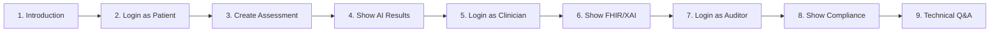

# 🎤 RMD-Health Demo Speaking Guide

> **Use this guide when presenting the RMD-Health application during interviews or demonstrations.**

---

## 📋 Demo Flow Overview

---

## 🎬 Part 1: Introduction (1-2 minutes)

### What to Say:

> "Welcome to RMD-Health, an AI-powered Clinical Decision Support System I built for early detection of Rheumatic and Musculoskeletal Diseases.
>
> This prototype demonstrates several key technologies:
> - **Agentic AI** using LangChain and LangGraph
> - **Explainable AI** with role-based explanations
> - **FHIR R4 compliance** for NHS interoperability
> - **NHS GDPR compliance** with pseudonymization and audit trails
>
> Let me show you how it works..."

### Key Points to Emphasize:
- ✅ This is a **demonstration prototype**, not for clinical use
- ✅ Built for the **University of Reading RMD-Health project**
- ✅ Follows **NHS Digital Technology Assessment Criteria (DTAC)**

---

## 🧑 Part 2: Patient Flow (3-4 minutes)

### Step 2.1: Login

> "Let's start by logging in as a patient. I'll use the demo account."

**Action:** Login with `patient1@rmd-health.demo` / `patient123`

> "Notice the interface is designed to be patient-friendly with simple language."

### Step 2.2: Show AI Mode Toggle

> "In the sidebar, you'll see an **AI Mode toggle**. When this is OFF, the system uses the actual **Groq LLM with Agentic AI**. When ON, it uses a rule-based demo mode.
>
> Let me turn OFF demo mode so you can see the real AI in action..."

**Action:** Toggle OFF "Demo Mode" in sidebar

### Step 2.3: Create New Assessment

> "Now let's create a symptom assessment. I'll click 'New Assessment'."

**Action:** Navigate to New Assessment

> "First, notice the **CDSS disclaimer** at the top - this is required for Class IIa medical devices under UK MDR 2002. It clearly states this is for screening only and requires clinical validation."

### Step 2.4: Fill in Symptoms

> "I'll fill in some symptoms for a high-risk patient scenario..."

**Action:** Click "🔴 High Risk" sample data button OR manually fill:
- Age: 52
- Sex: Female
- Joint pain: ✅ (severity 8)
- Multiple joints: ✅
- Morning stiffness: ✅ (75 minutes)
- Joint swelling: ✅
- Fatigue: ✅

> "These symptoms are consistent with possible inflammatory arthritis - prolonged morning stiffness over 30 minutes is a key indicator."

### Step 2.5: Run Assessment

**Action:** Click "Check My Symptoms"

> "Now watch - the **Agentic AI** is analyzing the symptoms. It's using a LangGraph ReAct agent that autonomously decides which analysis tools to call..."

**Wait for results**

> "You can see it says **'Powered by: Groq LLM (Agentic AI)'** - this confirms the actual LLM was used, not just rules."

### Step 2.6: Explain Results

> "The system returned a **HIGH RISK** assessment with 85% confidence. 
>
> Notice the **patient-friendly explanation** - it uses plain language without medical jargon. This is the **Explainable AI** module adapting the explanation for the patient role.
>
> The recommended next step is to see a GP for rheumatology referral."

---

## 👨‍⚕️ Part 3: Clinician Flow (2-3 minutes)

### Step 3.1: Login as Clinician

**Action:** Logout → Login with `clinician@rmd-health.demo` / `clinician123`

> "Now let's see the same system from a clinician's perspective."

### Step 3.2: Show Pseudonymization

> "Notice something important - I can see all patients, but their names are **pseudonymized**. Instead of 'John Smith', I see 'PT-A1B2C3D4 (JS)'.
>
> This is **NHS GDPR compliance** - specifically the Caldicott Principles. Clinicians see enough to identify patterns but not full PII unless absolutely necessary."

### Step 3.3: View Patient Assessment

**Action:** Click "View" on a patient with assessments

> "In the clinical view, I get much more detailed information:
> - **Technical XAI explanation** with clinical terminology
> - **Feature contributions** showing which symptoms increased risk
> - **FHIR Bundle** for interoperability"

### Step 3.4: Show FHIR Bundle

**Action:** Expand the FHIR Bundle section

> "This is a proper **FHIR R4 Bundle** following UK Core profiles. It contains:
> - A **Patient resource** with pseudonymized identifier
> - **Observation resources** for each symptom with SNOMED CT codes
> - A **RiskAssessment resource** with the AI's findings
>
> This format is what NHS systems expect for data exchange."

---

## 📋 Part 4: Auditor Flow (2 minutes)

### Step 4.1: Login as Auditor

**Action:** Logout → Login with `auditor@rmd-health.demo` / `admin123`

> "Finally, let's look at the auditor view for regulatory compliance."

### Step 4.2: Show Audit Trail

> "Auditors see **complete audit logs** with:
> - Timestamps for every action
> - **Hash verification** for data integrity
> - Pseudonymized patient references
> - All assessment details for compliance review
>
> This is crucial for **MHRA compliance** and NHS Digital DTAC requirements."

### Step 4.3: Show Export

**Action:** Navigate to Export page

> "Auditors can export all data to CSV for external compliance review. This supports the **Right of Access** under GDPR."

---

## 🤖 Part 5: Technical Deep Dive (if asked)

### About Agentic AI

> "The core of this system is a **LangGraph ReAct agent**. Unlike traditional chatbots that just respond, this agent:
>
> 1. **Reasons** about the patient data
> 2. **Decides** which tools to call - it's not hardcoded
> 3. **Observes** the results
> 4. **Continues** or provides final answer
>
> I have 5 specialized tools:
> - `analyze_inflammatory_markers` - checks swelling, redness, stiffness
> - `analyze_joint_pattern` - polyarticular vs monoarticular
> - `analyze_systemic_symptoms` - fatigue, fever, weight loss
> - `calculate_risk_score` - quantitative scoring
> - `get_differential_diagnosis` - possible conditions"

### About Groq Integration

> "I use **Groq's free API** with Llama 3.1. Groq provides extremely fast inference - you saw the response in just a few seconds. The API key is stored securely in environment variables, never in code."

### About XAI

> "The XAI module generates three different explanations from the same assessment:
> - **Patient**: Simple, reassuring, plain language
> - **Clinician**: Technical, evidence-based, clinical terminology
> - **Auditor**: Complete decision trace, timestamps, hashes
>
> This is based on research showing that different stakeholders need different types of AI explanations."

### About FHIR

> "FHIR R4 is the NHS standard for healthcare data exchange. My resources follow **UK Core profiles** and use **SNOMED CT codes** for symptoms. For example, joint pain is coded as SNOMED 57676002.
>
> The bundles are ready to send to NHS systems via FHIR APIs."

---

## ❓ Common Questions & Answers

### "Is this ready for real patients?"
> "No - this is a demonstration prototype. For real deployment, it would need:
> - Clinical validation studies
> - MHRA Class IIa certification
> - NHS IG Toolkit compliance
> - Penetration testing
> - Real-world performance monitoring"

### "Why Groq instead of OpenAI?"
> "Groq offers a **free tier** which is perfect for prototyping and demonstrations. Their inference is also very fast. In production, we'd evaluate multiple providers for cost, latency, and compliance."

### "How is this different from ChatGPT?"
> "Three key differences:
> 1. **Agentic** - it uses tools and reasons, not just generates text
> 2. **Structured output** - returns validated JSON, not free text
> 3. **Domain-specific** - tools are designed for RMD screening
> 4. **Compliant** - built with NHS GDPR requirements from the start"

### "What about hallucinations?"
> "The agentic approach reduces hallucination risk because:
> - Tools return factual, structured data
> - The LLM synthesizes tool outputs rather than inventing facts
> - Output schema is enforced via Pydantic
> - The system clearly states it's a screening tool, not diagnosis"

---

## ⏱️ Timing Guide

| Section | Duration | Running Total |
|---------|----------|---------------|
| Introduction | 1-2 min | 2 min |
| Patient Flow | 3-4 min | 6 min |
| Clinician Flow | 2-3 min | 9 min |
| Auditor Flow | 2 min | 11 min |
| Q&A | 4-5 min | 15 min |

**Total Demo: ~15 minutes**

---

## 🎯 Key Messages to Reinforce

1. **Agentic AI** = LLM autonomously decides which tools to use
2. **Explainable AI** = Different explanations for different audiences
3. **FHIR R4** = NHS interoperability standard
4. **NHS GDPR** = Pseudonymization + Caldicott Principles
5. **CDSS Compliance** = Clear disclaimers, not for diagnosis

---

## 🚨 If Something Goes Wrong

### API Error
> "The Groq API seems to be having issues. Let me switch to demo mode which uses rule-based analysis instead..."

**Action:** Toggle ON "Demo Mode"

### Slow Response
> "The LLM is processing - this sometimes takes a few seconds. It's analyzing multiple symptoms and running through its reasoning chain..."

### Login Issues
> "Let me recreate the database - this can happen if the demo data was reset..."

**Action:** Delete `data/rmd_health.db` and restart app

---

**Good luck with your demo! 🍀**

*Remember: Confidence comes from knowing your system inside out.*

