# 🏥 RMD-Health: AI-Powered Rheumatoid Disease Screening Agent

<div align="center">

[](https://rmd-health.streamlit.app)
[](https://www.python.org/downloads/)
[](LICENSE)
[](https://www.hl7.org/fhir/)
[](docs/NHS_GDPR_COMPLIANCE.md)

**A Clinical Decision Support System (CDSS) prototype demonstrating Agentic AI, Explainable AI (XAI), and FHIR R4 compliance for early detection of Rheumatic and Musculoskeletal Diseases (RMDs).**

*Built for the University of Reading RMD-Health Project*

</div>

---

## ⚠️ Important Disclaimer

> **This is a DEMONSTRATION PROTOTYPE only.** It is NOT intended for clinical use, real patient data, or medical decision-making. All outputs are simulated and should NOT be considered medical advice. Always consult qualified healthcare professionals.

---

## 🏗️ System Architecture

```mermaid
flowchart TB
    subgraph Users["👥 Users"]
        P[("🧑 Patient")]
        C[("👨‍⚕️ Clinician")]
        A[("📋 Auditor")]
    end
    
    subgraph Frontend["🖥️ Streamlit Frontend"]
        UI[Web Interface]
        Auth[Authentication]
        RBV[Role-Based Views]
    end
    
    subgraph Agent["🤖 Agentic AI Core"]
        LLM["Groq LLM\n(Llama 3.1)"]
        ReAct["LangGraph\nReAct Agent"]
        
        subgraph Tools["🔧 Analysis Tools"]
            T1[analyze_inflammatory_markers]
            T2[analyze_joint_pattern]
            T3[analyze_systemic_symptoms]
            T4[calculate_risk_score]
            T5[get_differential_diagnosis]
        end
    end
    
    subgraph XAI["🔍 Explainable AI"]
        LIME["LIME/SHAP-style\nFeature Contributions"]
        TRACE["ReAct\nReasoning Trace"]
        ROLE["Role-Based\nExplanations"]
    end
    
    subgraph Compliance["📋 Compliance Layer"]
        FHIR["FHIR R4\nBundle Generator"]
        GDPR["NHS GDPR\nPseudonymization"]
        AUDIT["Audit Trail\nLogger"]
    end
    
    subgraph Storage["💾 Data Layer"]
        DB[(SQLite DB)]
        EXPORT[CSV Export]
    end
    
    P & C & A --> UI
    UI --> Auth
    Auth --> RBV
    RBV --> ReAct
    ReAct --> LLM
    LLM --> Tools
    Tools --> XAI
    XAI --> FHIR
    FHIR --> GDPR
    GDPR --> AUDIT
    AUDIT --> DB
    DB --> EXPORT
```



---

## 🔄 Agentic AI Workflow

```mermaid
sequenceDiagram
    participant U as 👤 User
    participant UI as 🖥️ Streamlit
    participant A as 🤖 ReAct Agent
    participant LLM as 🧠 Groq LLM
    participant T as 🔧 Tools
    participant X as 🔍 XAI
    participant F as 📦 FHIR
    
    U->>UI: Submit Symptoms
    UI->>A: Patient Data (JSON)
    
    rect rgb(230, 240, 255)
        Note over A,T: ReAct Loop - LLM Decides Tools
        A->>LLM: Analyze patient + available tools
        LLM->>A: Thought: Need inflammatory analysis
        A->>T: Call analyze_inflammatory_markers()
        T->>A: Inflammatory findings
        A->>LLM: Observation received, continue?
        LLM->>A: Thought: Check joint pattern
        A->>T: Call analyze_joint_pattern()
        T->>A: Joint pattern analysis
        LLM->>A: Thought: Calculate risk score
        A->>T: Call calculate_risk_score()
        T->>A: Risk score: HIGH
        LLM->>A: Final Answer (JSON)
    end
    
    A->>X: Generate XAI Explanation
    X->>F: Create FHIR Bundle
    F->>UI: Assessment + FHIR + XAI
    UI->>U: Display Results
```



---

## 🎯 Key Features

### 🤖 Agentic AI (LangChain + LangGraph)
- **ReAct Pattern**: LLM autonomously reasons about which tools to use
- **5 Specialized Tools**: Inflammatory markers, joint patterns, systemic symptoms, risk scoring, differential diagnosis
- **Groq Integration**: Free LLM inference with Llama 3.1

### 🔍 Explainable AI (XAI)
- **LIME/SHAP-style** feature contribution scores
- **Role-based explanations**: Technical for clinicians, plain language for patients
- **ReAct reasoning traces** for complete transparency

### 🏥 FHIR R4 Compliance
- **UK Core Profiles**: Patient, Observation, RiskAssessment
- **SNOMED CT Coding**: Standard medical terminology
- **Interoperable Bundles**: Ready for NHS integration

### 🔒 NHS GDPR Compliance
- **Pseudonymization**: Patient IDs hashed for clinician/auditor views
- **Caldicott Principles**: Minimum necessary information
- **Audit Logging**: Hash-verified decision trail

---

## 👥 Multi-User System

| Role | Access Level | Features |
|------|--------------|----------|
| **🧑 Patient** | Own data only | View history, create assessments, plain-language explanations |
| **👨‍⚕️ Clinician** | All patients (pseudonymized) | Clinical details, FHIR bundles, technical XAI |
| **📋 Auditor** | Full audit access | Complete logs, CSV export, compliance review |

---

## 🚀 Quick Start

### Prerequisites
- Python 3.10+
- Groq API Key (free at [console.groq.com](https://console.groq.com))

### Installation

```bash
# Clone repository
git clone https://github.com/YOUR_USERNAME/RMD_Agent_Demo.git
cd RMD_Agent_Demo

# Create virtual environment
python -m venv venv
source venv/bin/activate  # Windows: venv\Scripts\activate

# Install dependencies
pip install -r requirements.txt

# Configure environment
cp .env.example .env
# Edit .env and add your GROQ_API_KEY

# Run the application
streamlit run app_multiuser.py
```

### Demo Credentials

| Role | Email | Password |
|------|-------|----------|
| **Auditor** | auditor@rmd-health.demo | admin123 |
| **Clinician** | clinician@rmd-health.demo | clinician123 |
| **Patient** | patient1@rmd-health.demo | patient123 |

---

## 📁 Project Structure

```
RMD_Agent_Demo/
├── app_multiuser.py          # 🚀 Main app with authentication
├── app.py                    # Single-user demo (no login)
├── requirements.txt          # Python dependencies
├── .env.example              # Environment template
├── .gitignore                # Git exclusions (GDPR compliant)
│
├── src/
│   ├── rmd_agent.py          # 🤖 Agentic AI (LangGraph ReAct)
│   ├── xai_explanations.py   # 🔍 Explainable AI module
│   ├── fhir_resources.py     # 🏥 FHIR R4 resource builder
│   ├── data_models.py        # 📋 Pydantic validation models
│   ├── database.py           # 💾 SQLite + authentication
│   └── utils.py              # Helper functions
│
├── docs/
│   ├── NHS_GDPR_COMPLIANCE.md    # Compliance documentation
│   ├── FHIR_MAPPING.md           # FHIR resource mappings
│   ├── ARCHITECTURE.md           # Technical architecture
│   └── ABOUT_RMD.md              # Clinical background
│
├── sample_data/              # Example patient data (fictional)
└── data/                     # SQLite database (auto-created)
```

---

## 🛠️ Technology Stack

| Layer | Technology | Purpose |
|-------|------------|---------|
| **Frontend** | Streamlit | Interactive web UI |
| **Agentic AI** | LangChain + LangGraph | ReAct agent framework |
| **LLM** | Groq (Llama 3.1) | Free inference API |
| **Data Validation** | Pydantic | Type-safe models |
| **Database** | SQLite | User/assessment storage |
| **Healthcare Standard** | FHIR R4 | Interoperability |
| **Medical Coding** | SNOMED CT | Clinical terminology |

---

## 📊 Sample Output

### Risk Assessment
```json
{
  "risk_level": "HIGH",
  "confidence_score": 0.85,
  "likely_conditions": ["Rheumatoid Arthritis", "Inflammatory Arthritis"],
  "red_flags_identified": ["Prolonged morning stiffness", "Joint swelling"],
  "recommended_next_step": "Urgent rheumatology referral recommended"
}
```

### FHIR Bundle (Preview)
```json
{
  "resourceType": "Bundle",
  "type": "collection",
  "entry": [
    {"resource": {"resourceType": "Patient", "id": "PT-A1B2C3D4"}},
    {"resource": {"resourceType": "Observation", "code": {"coding": [{"system": "http://snomed.info/sct", "code": "57676002", "display": "Joint pain"}]}}},
    {"resource": {"resourceType": "RiskAssessment", "prediction": [{"qualitativeRisk": {"text": "HIGH"}}]}}
  ]
}
```

---

## 🌐 Deployment

### Streamlit Community Cloud (Recommended)
1. Push to GitHub
2. Go to [share.streamlit.io](https://share.streamlit.io)
3. Connect repository, select `app_multiuser.py`
4. Add secret: `GROQ_API_KEY`

### Hugging Face Spaces
1. Create new Space (Streamlit SDK)
2. Upload files
3. Set environment variable: `GROQ_API_KEY`

---

## 📚 Documentation

- [NHS GDPR Compliance](docs/NHS_GDPR_COMPLIANCE.md)
- [FHIR Resource Mapping](docs/FHIR_MAPPING.md)
- [Technical Architecture](docs/ARCHITECTURE.md)
- [Demo Speaking Guide](DEMO_GUIDE.md)

---

## 📄 License

MIT License - see [LICENSE](LICENSE) for details.

---

## 🙏 Acknowledgments

- University of Reading RMD-Health Research Team
- NHS Digital for FHIR UK Core specifications
- Groq for free LLM API access
- LangChain team for the agent framework

---

<div align="center">

**Built with ❤️ for Healthcare AI Research**

*University of Reading • RMD-Health Project • 2026*

</div>
